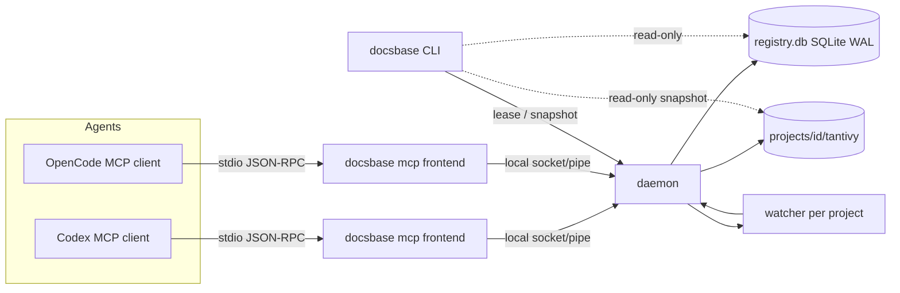

# Architecture

Short operator's view. Full spec: `specs/docsbase-memory-mcp/design.md`.

## Roles

One binary, three roles:

- **CLI** (`docsbase <cmd>`) — parses args, talks to the daemon when
  reachable, else falls back to read-only snapshots (FR-30).
- **MCP frontend** (`docsbase mcp`) — thin stdio proxy: ensures the daemon,
  binds the session, forwards tool calls (FR-7).
- **Daemon** (`docsbase serve`, supervised) — owns registry, indexes,
  watchers, sync jobs; single writer per index (WAL + lock recovery).



## Runtime layout

```text
$CACHE (0700; DOCSBASE_CACHE_DIR override)
├── state/daemon.json        # pid, endpoint, build_id, schema_version
├── state/daemon.sock        # Unix socket (0600) — Windows: named pipe instead
├── state/*.lock             # start/admission flock
├── registry.db              # SQLite WAL: projects/docs/chunks/sync_jobs
├── projects/<id>/tantivy/   # per-project FTS index (derivable, rebuildable)
├── projects/<id>/.writer.lock
└── logs/{daemon.log, conflicts.ndjson}

$CONFIG — config.toml (global)
$DATA   — bin/docsbase + install.json (owned manifest)
Project — .docsbase.toml, .docsbaseignore
```

Indexes are derived data: they can always be rebuilt from the `.md` sources.

## Platform seam (ADR-9/ADR-10)

All OS-dependent code lives in `src/platform/` behind a small facade:
transport (`Endpoint`: Unix path vs `\\.\pipe\docsbase-<blake3>`),
signals, process liveness (`/proc` vs `OpenProcess`), permissions
(`0600`/`0700` vs best-effort ACLs), path semantics (case, separators,
verbatim `\\?\`, system roots). Everything else is platform-agnostic and
selected by `#[cfg]` only inside the seam. `platform_boundary` tests pin it.

## Contracts & versioning

Versioned: `protocol_version` (socket), `schema_version` (DB),
MCP tool shapes, CLI surface, config format. Breaking changes require a
major version; wire/DB mismatches fail with an actionable `Admission` error
(`docsbase install` is the remedy for stale state).

## Supply chain

`Cargo.lock` committed, `--locked` everywhere, crates.io
`min-publish-age = 14 days` (nightly-only feature, no `[unstable]` needed),
no network at runtime by default (hybrid stages are opt-in per project/request,
constitution 1.2.0), releases with sha256 + SBOM + SLSA provenance.
