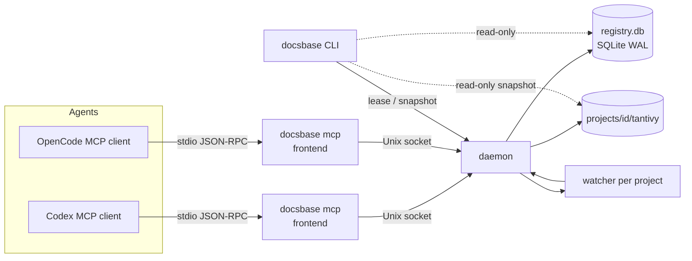

# Technical Design: docsbase-memory-mcp

**Status:** Draft
**Дата:** 2026-09-28
**Spec:** `docs/specs/docsbase-memory-mcp/requirements.md` (rev 2)
**Constitution:** `docs/specs/constitution.md`

## 1. Overview

`docsbase` — один Rust-бинарь с тремя ролями: CLI, тонкий stdio-MCP-frontend и
per-account daemon. Daemon владеет реестром проектов, per-project индексами
(SQLite + tantivy), watcher'ами и sync-джобами; frontend'ы подключаются к нему через
Unix socket и пробрасывают MCP tool-calls. Индексация явная (`index_project`), опционально
автоматическая (`auto_index`, default false). Реализует FR-1…FR-34, NFR-1…NFR-9.

## 2. Global constraints

Скопировано из constitution:

- Rust, edition 2024, MSRV 1.88; `cargo fmt`, `cargo clippy -- -D warnings`.
- v1 — Linux/WSL2 (x86_64) только; `#[cfg(unix)]` там, где нужно.
- Один статический бинарь; ноль сетевых вызовов и внешних сервисов в рантайме.
- `unwrap`/`expect` запрещены в библиотечном коде; `thiserror` в libs, `anyhow` на границе.
- Один canonical cache root; версия схемы; один writer.
- Крейты — только из таблицы §7; крейт вне списка — через ADR; каждый новый крейт
  обосновывается в шапке задачи.

## 3. Architecture



Компоненты и границы — разделы 4–6. Все публичные контракты версионируются
(`protocol_version`, `schema_version`) — NFR-7.

### Runtime layout

```
$CACHE = ~/.cache/docsbase-memory-mcp (0700)
├── state/daemon.json          # pid, socket, build_id, schema_version, cache_root
├── state/daemon.sock          # Unix socket, 0600 (FR-33)
├── state/daemon.start.lock    # flock: гонка старта (FR-9)
├── state/admission.lock       # flock: admission/lease (FR-4)
├── registry.db                # SQLite WAL: projects/docs/chunks/sync_jobs (NFR-3)
├── projects/<id>/tantivy/     # per-project FTS index (FR-19)
├── projects/<id>/.writer.lock # per-project writer lock
└── logs/{daemon.log, conflicts.ndjson}   # NFR-8, FR-4

$CONFIG = ~/.config/docsbase-memory-mcp/config.toml   # FR-28
$DATA = ~/.local/share/docsbase-memory-mcp            # FR-1, FR-5 (T25)
├── bin/docsbase               # installed binary (0755)
└── install.json               # owned manifest: binary, socket, cache_root, versions
Project: .docsbase.toml, .docsbaseignore              # FR-14, FR-28
```

## 4. Components

| Компонент | Ответственность | Публичный интерфейс | Зависит от | FR |
|---|---|---|---|---|
| `cli` | Парсинг и выполнение команд | `docsbase <cmd>` | daemon client, config, index (snapshot) | FR-30 |
| `mcp::frontend` | stdio MCP server; проксирование в daemon; ensure daemon | MCP tools | ipc client, rmcp | FR-7, FR-20…FR-27 |
| `daemon::lifecycle` | Старт/стоп, grace, admission, lock recovery | socket, `daemon stop` | store, ipc, admission | FR-2, FR-4, FR-5, FR-6, FR-9 |
| `daemon::server` | Accept loop, маршрутизация запросов | `Request -> Response` | session, registry, index, watch | FR-3, FR-25, FR-26 |
| `daemon::session` | Регистрация сессий, учёт соединений, cleanup | session registry | ipc | FR-2, FR-3, FR-8, NFR-9 |
| `daemon::registry` | Реестр проектов и статусы | `list_projects`, `index_project` | store | FR-10, FR-11, FR-12, FR-13 |
| `index::walk` | Обход `.md` с игнорами и границами root | `walk(root) -> [Path]` | ignore | FR-14, FR-32 |
| `index::frontmatter` | Разбор опционального YAML-frontmatter | `parse(text) -> (meta, body)` | — | FR-18 |
| `index::chunk` | Heading-чанкование, breadcrumb, code fences | `chunk(md) -> [Chunk]` | pulldown-cmark | FR-22 |
| `index::tantivy_index` | Схема, writer, reader, удаление чанков | `add/delete/search` | tantivy | FR-19, FR-21, FR-27, NFR-1 |
| `index::tokenizer` | camel/snake/идентификаторный токенизатор | `Tokenizer` | tantivy | FR-21 |
| `index::job` | Полный/инкрементальный прогон, sync-джобы | `run_job(project)` | walk, chunk, store, tantivy | FR-15…FR-17, NFR-1 |
| `watch` | Debounce и коалесценция событий | `WatcherEvents` | notify | FR-15, NFR-4 |
| `store` | SQLite-модель, миграции, реестр | repositories | rusqlite | FR-10, FR-16, FR-26, NFR-7 |
| `config` | Global/project config, precedence, paths | `Config::load` | toml, directories | FR-28, FR-29 || `ipc` | Версионированный JSON-RPC поверх UnixStream | `Request/Response` | serde, tokio | FR-7, FR-33 |
| `error` | Таксономия ошибок и маппинг в MCP/CLI | `enum Error` | thiserror | NFR-8 |

## 5. Module interfaces

Ключевые типы и инварианты (сокращённо):

```rust
// ipc/protocol.rs — FR-7, FR-33
#[derive(Serialize, Deserialize)]
#[serde(tag = "method", content = "params")]
pub enum Request {
    Hello { protocol_version: u32, build_id: String, client: String },
    RegisterSession { pid: u32, cwd: PathBuf },
    CallTool { name: String, args: serde_json::Value },
    StopDaemon,
}

#[derive(Serialize, Deserialize)]
pub enum Response {
    Hello { protocol_version: u32, build_id: String, schema_version: u32 },
    ToolResult { value: serde_json::Value },
    Error { code: ErrorCode, message: String },
    Stats { fd_count: usize, sessions: usize, threads: usize },
}

// index/chunk.rs — FR-22, NFR-1
pub struct Chunk {
    pub doc_id: i64,
    pub seq: u32,
    pub heading_path: Vec<String>, // breadcrumb: file > H1 > H2
    pub kind: ChunkKind,           // Prose | Code { lang } | Table
    pub line_start: u32,
    pub line_end: u32,
    pub text: String,
}

/// Инвариант: чанк не начинается/не заканчивается внутри code fence;
/// секция > max_chunk_chars режется по границам абзацев, но не внутри fence.
pub fn chunk_markdown(body: &str, max_chunk_chars: usize) -> Vec<Chunk>;

// index/tokenizer.rs — FR-21
/// "defineStore" -> ["definestore", "define", "store"]
/// "__bt_tt_getProp" -> ["__bt_tt_getprop", "bt", "tt", "getprop", "get", "prop"]
/// "X-Request-ID" -> ["x-request-id", "x", "request", "id"]
pub struct IdentifierTokenizer;

// store/models.rs — FR-10, FR-16
pub struct Project {
    pub id: i64,
    pub canonical_root: PathBuf,
    pub status: ProjectStatus, // NotIndexed | Indexing | Indexed | Error
    pub schema_version: u32,
}
```

Инварианты:

- **I1 (FR-4):** daemon не обслуживает запросы, если `build_id`/`schema_version` не
  совпадают с записанными в `state/daemon.json`.
- **I2 (FR-8):** сессия существует ровно пока жив её socket; при EOF/ошибке запись
  удаляется, связанные ресурсы освобождаются.
- **I3 (FR-13):** `canonical_root` — результат `realpath` + git root; дубликаты
  невозможны, повторный `index_project` идемпотентен.
- **I4 (FR-32):** любой путь перед использованием проверяется на префикс зарегистрированных
  roots после `realpath`; symlink наружу — ошибка.
- **I5 (NFR-3):** на проект — не более одного `IndexWriter` и одного активного job.
  Index/sync jobs принадлежат **daemon**, а не сессии: смерть frontend не прерывает
  индексацию (FR-3).
- **I6 (FR-20):** сессия привязана к проекту по `cwd` — ближайший зарегистрированный
  ancestor; незарегистрированный проект → `Project`-ошибка с инструкцией вызвать
  `index_project`.
- **I7 (FR-32):** регистрировать можно только существующую директорию; realpath не может
  быть `/`, `$HOME` или cache root; хранится realpath (FR-13).
- **I8 (FR-34):** frontend валидирует имя tool по allowlist; неизвестное имя не уходит в
  daemon.

## 6. Data flow

**Старт и подключение (FR-2, FR-7, FR-9):**

1. Агент спавнит `docsbase mcp`.
2. Frontend пытается подключиться к `$CACHE/state/daemon.sock`.
3. Нет daemon → `flock(state/daemon.start.lock)`; победитель спавнит
   `docsbase serve --detached` и ждёт появления сокета (timeout 10 с); остальные ждут.
4. `Hello` → проверка `protocol_version`/`build_id`; затем `RegisterSession { pid, cwd }` —
   daemon привязывает сессию к ближайшему зарегистрированному проекту (I6); иначе
   `Project`-ошибка с инструкцией `index_project` (C8).
5. Смерть frontend → daemon видит EOF, чистит сессию (I2), если это была последняя —
   запускает grace-timer (OQ-7: 5 с) и завершается. Daemon-owned jobs при этом не
   отменяются (I5).

**Индексация (FR-10…FR-18):**

1. `index_project(path)` → `registry.ensure(path)` → `ProjectStatus::Indexing`.
2. `walk` → список `.md`; для каждого: hash → сравнение с `docs.content_hash`.
3. Новые/изменённые → `frontmatter` + `chunk` → tantivy `delete_term(doc_id)` + `add`.
4. SQLite: upsert `docs`/`chunks`; удалённые → `delete`.
5. Перед tantivy-операциями изменённые и удаляемые документы помечаются in-flight
   (`content_hash = ''` в SQLite); затем commit tantivy, затем commit SQLite
   (при краше повторный прогон переобрабатывает помеченные документы и сходится).
6. `ProjectStatus::Indexed`, `last_indexed_at`. Job принадлежит daemon: смерть frontend не
   прерывает прогон.

**CLI (FR-30):** сначала пробует подключиться к сокету; если daemon жив — идёт через него
(консистентно, без второго writer). Если daemon не запущен — команды чтения открывают
`registry.db`/tantivy в read-only snapshot, мутирующие берут per-project lease (FR-30).

**Конфиг (OQ-6, FR-28/29):** global читается на старте daemon; project — при открытии
проекта. Изменение global требует рестарта daemon (`docsbase daemon stop`), что
документируется в сообщении `status`.

**Правка файла (FR-15, FR-16, NFR-4):** watcher → debounce 1.5 с → коалесценция →
инкрементальный job по затронутым файлам → поиск видит новую версию ≤ 2 с.

**Поиск (FR-19…FR-21):**

1. `search_docs(query)` → frontend → IPC.
2. Запрос токенизируется `IdentifierTokenizer`; строится `BooleanQuery` по полям
   `text^1.0`, `title^2.0`, `heading_path^1.5`, `identifiers^2.5`, BM25.
3. Top-k → join с SQLite для citation (`path`, `heading_path`, `lines`).
4. Чанки длиннее `max_chunk_chars` получают штраф 0.5 до усечения top-k; поле
   `title` — верхний заголовок документа, а не последний (T27).
5. Ответ через IPC → MCP.

## 7. Dependencies + rationale

| Крейт | Зачем | FR/NFR |
|---|---|---|
| `rmcp` | официальный MCP SDK (stdio, типы tools) | FR-7, FR-20…27 |
| `tokio` (`rt-multi-thread`, `net`, `fs`, `time`, `signal`) | runtime для rmcp, socket, watcher | FR-2, FR-7 |
| `clap` (derive) | CLI и subcommand'ы | FR-30 |
| `tantivy` | BM25/FTS, кастомный токенизатор, реляционная выдача | FR-19, FR-21, NFR-1 |
| `pulldown-cmark` | Markdown → события с byte-offset (line ranges, fences, tables) | FR-22 |
| `rusqlite` (`bundled`) | метаданные и реестр; статическая сборка SQLite | FR-10, FR-16, NFR-6 |
| `notify` | watcher; debounce/коалесценция — собственный quiet-collector 1.5 с (кап 2 с) | FR-15, NFR-4 |
| `ignore` | обход с gitignore-семантикой, `.docsbaseignore` и границы root | FR-14, FR-32 |
| `blake3` | content hash | FR-16 |
| `serde`, `serde_json` | IPC и MCP payloads | FR-7 |
| `toml` | конфиги | FR-28 |
| `directories` | XDG пути (cache/config) | FR-28, FR-29 |
| `fd-lock` | RAII flock для admission/locks | FR-4, FR-9 |
| `thiserror`, `anyhow` | таксономия ошибок | constitution |
| `tracing`, `tracing-subscriber` | структурные логи, conflict-log | NFR-8 |
| dev: `tempfile`, `assert_cmd`, `insta`, `criterion` | интеграционные, golden и perf-тесты (T27, T30) | NFR-1, NFR-7 |

**Точечные альтернативы:** вместо `serde_yaml` — минимальный flat-парсер frontmatter
(только `key: value`, вложенность не нужна); при росте требований заменить через ADR.

## 8. Required / Forbidden stack

- **Required:** `rmcp`, `tantivy`, `pulldown-cmark`, `rusqlite`, `tokio`, `clap`.
- **Forbidden:** любые сетевые клиенты (`reqwest`, `hyper`-клиенты), embedding/LLM SDK,
  Docker/внешние БД, Python/Node в рантайме, `unsafe` без `SAFETY`.
- Фаза 2 (за флагом): `fastembed`, `usearch`, RRF — добавляются только после бенчмарка.

## 9. Error handling

| Категория | Пример | Поведение | Код MCP |
|---|---|---|---|
| `Admission` | build/schema/root mismatch | отказ до работы, conflict-log (`build_id`, `schema_version`, `cache_root`, `pid`), сообщение с командой (`docsbase install`, rebuild через `docsbase index`) | `-32010` |
| `Protocol` | несовпадение `protocol_version` | закрыть соединение с понятной ошибкой | `-32011` |
| `Project` | проект не зарегистрирован, путь вне root | инструкция вызвать `index_project` | `-32012` |
| `Index` | IO/parse ошибка файла | файл пропускается, остальные индексируются, warning в `status` | `-32013` |
| `Query` | пустой/битый запрос | понятная ошибка без паники | `-32014` |
| `Internal` | прочее | лог + маскированное сообщение | `-32603` |

Правило: ошибка одного файла не валит job (A4); ошибка файла фиксируется в `status`.

## 10. Testing strategy

- **Unit:** chunker (границы fence/heading/абзацев), tokenizer (3 примера из
  спецификации), frontmatter, ignore-правила, precedence конфигов, line-range.
- **Integration (`tests/`):**
  - lifecycle: первый frontend поднимает daemon, последний гасит, grace, `daemon stop`;
  - cleanup (FR-8/NFR-9): kill -9 frontend → ресурсы освобождены ≤ 2 с; 1000 циклов — без
    роста fd/потоков;
  - admission (FR-4/FR-9): подмена `build_id` → отказ + conflict-log; recovery lock;
  - registry/indexing (FR-10…FR-18): not_indexed → index_project → indexed; инкремент;
    удаление файла; `auto_index = true`;
  - watcher (FR-15): debounce, коалесценция git-checkout-подобного всплеска;
  - CLI snapshot (FR-30): поиск при живом daemon и без него.
- **Golden (SC-1…SC-4):** фиксированный корпус + 4 типа запросов; снапшоты top-3.
- **Perf (NFR-1/2):** criterion для search/index; 50k чанков.
- **Soak (SC-5):** 3 агента + watcher 1 час (CI nightly).
- **Offline (SC-8):** тест в network namespace, проверка отсутствия connect().

## 11. Risks & trade-offs

| # | Риск | Вероятн. | Влияние | Митигация |
|---|---|---|---|---|
| R1 | Полный CBM-протокол (C1) съедает срок | высокая | высокое | Поэтапный ввод: S1 lock+lifecycle → S2 version/schema-проверки → S3 conflict-лог → S4 install/update coordination. Резать S3 → S2 при перерасходе |
| R2 | Две БД (SQLite + tantivy) расходятся при краше | средняя | среднее | Порядок commit'ов + сходимость по hash; тест с инъекцией краша между commit'ами |
| R3 | tantivy writer/reader конкуренция | средняя | среднее | Один `IndexWriter` на проект (I5); readers с `ReloadPolicy` |
| R4 | watcher-шторм при массовых операциях | средняя | среднее | Debounce + коалесценция; игнор директории индекса |
| R5 | Orphan daemon после краша | средняя | низкое | `daemon.json` + сокет; при старте — проверка pid и очистка stale |
| R6 | `rmcp` API меняется | низкая | среднее | Пин версии; адаптер в `mcp/` изолирует API |
| R7 | Line-range расходится с реальным файлом | низкая | низкое | Offsets из pulldown-cmark + тесты на edge cases |
| R8 | Корень проекта исчез/перемещён | средняя | низкое | `status = error` для записи; автоудаления нет; повторный `index_project` по новому пути создаёт запись и явно помечает старую |

**Компромиссы:** per-project индексы не дают кросс-проектного поиска (вернётся shared-слоем,
P6); BM25-only не ловит парафразы (фаза 2); explicit index добавляет шаг настройки (взамен
предсказуемости и контроля ресурсов).

## 12. Alternatives considered (ADR)

**ADR-1. Per-project vs единый глобальный индекс.**
Рассматривали: (a) глобальный с collections; (b) per-project; (c) гибрид.
Выбрано **(b)** по требованию владельца: изоляция ресурсов и предсказуемость; кросс-проектные
доки откладываются (P6). Цена: дублирование vendor-доков, закрывается Context7/скиллами (C3).

**ADR-2. stdio+daemon vs HTTP localhost vs ручной сервер.**
Выбрано **stdio frontend + daemon** (модель CBM): клиенту не нужен URL/порт, автостарт
естественен, один writer. Цена: свой IPC и lifecycle. HTTP-вариант отвергнут из-за
ручного управления процессом и портами.

**ADR-3. Полный CBM admission-протокол vs лёгкий lock.**
Выбрано **полный протокол** (решение владельца, FR-4/FR-5/FR-9): точное совпадение
build/ABI/root, conflict-log, безопасный install/update. Цена — R1; вводится поэтапно.

**ADR-4. `pulldown-cmark` vs `comrak`.**
Выбрано **pulldown-cmark**: byte-offset'ы из коробки (линум ranges), быстрее, меньше
зависимостей. `comrak` дал бы AST, но требует ручного маппинга позиций.

**ADR-5. Один SQLite + tantivy per project vs SQLite per project.**
Выбрано **один `registry.db` + tantivy per project**: единый реестр упрощает `status`,
WAL-конкурентность, миграции; изоляция обеспечивается каталогом tantivy и префиксами.

**ADR-6. `auto_index` default.**
Выбрано **false** (FR-12): явный контроль ресурсов; неожиданная индексация большого
репозитория на первом подключении — плохой UX (C8). Mitigation: явная инструкция в `status`.

**ADR-7. sync vs async.**
Выбрано **tokio** из-за `rmcp`; тяжёлые операции (tantivy, SQLite, walk) — через
`spawn_blocking`; это держит IPC отзывчивым (NFR-1).

**ADR-8. Статическая сборка: gnu `+crt-static` vs musl (NFR-6, T32).**
Выбрано **`x86_64-unknown-linux-gnu` с `+crt-static`** (static-pie, 12 МБ stripped):
системный GCC линкует bundled C-код (SQLite, zstd) без кросс-тулчейна, бинарь
работает на любой glibc/WSL2. musl дал бы libc-free артефакт, но требует
`x86_64-linux-musl-gcc` для C-зависимостей; отложено до появления тулчейна в CI.
Rustflags заданы через alias `cargo release-static` (`--target` + target-scoped
`--config`), чтобы обычные host-сборки оставались динамическими (proc-macro не
собираются с `+crt-static`).

## 13. Directory structure

```
src/
├── main.rs                 # entry: dispatch CLI/subcommands
├── cli/                    # clap definitions + commands (FR-30)
│   ├── mod.rs
│   ├── index.rs            # docsbase index [path] (FR-11)
│   ├── search.rs           # docsbase search (FR-20)
│   ├── daemon.rs           # start/stop/status (FR-2, FR-6)
│   └── install.rs          # install/uninstall (FR-1, FR-31)
├── mcp/
│   ├── mod.rs
│   ├── frontend.rs         # stdio MCP server, ensure-daemon, proxy (FR-7)
│   └── tools.rs            # tool schemas (FR-20…FR-27)
├── daemon/
│   ├── mod.rs
│   ├── server.rs           # accept loop, routing (FR-3)
│   ├── session.rs          # session registry + cleanup (FR-8, NFR-9)
│   ├── lifecycle.rs        # start/stop/grace/admission (FR-2, FR-4…FR-6, FR-9)
│   └── registry.rs         # project registry (FR-10…FR-13)
├── ipc/
│   ├── mod.rs
│   └── protocol.rs         # Request/Response, protocol_version (FR-7)
├── index/
│   ├── mod.rs
│   ├── walk.rs             # ignore-aware walk (FR-14, FR-32)
│   ├── frontmatter.rs      # flat frontmatter (FR-18)
│   ├── chunk.rs            # heading chunker (FR-22)
│   ├── tokenizer.rs        # camel/snake tokenizer (FR-21)
│   ├── tantivy_index.rs    # schema/writer/reader (FR-19, NFR-1)
│   └── job.rs              # full/incremental jobs, sync (FR-15…FR-17)
├── watch/mod.rs            # debounced watcher (FR-15, NFR-4)
├── store/
│   ├── mod.rs
│   ├── migrations.rs       # schema_version (NFR-7)
│   └── models.rs           # projects/docs/chunks/sync_jobs
├── config/
│   ├── mod.rs              # load + precedence (FR-28, FR-29)
│   └── paths.rs            # XDG dirs
└── error.rs                # taxonomy (NFR-8)

tests/
├── lifecycle.rs
├── cleanup.rs
├── admission.rs
├── registry_indexing.rs
├── watcher.rs
├── search_golden.rs
├── cli_snapshot.rs
└── offline.rs
```

## 14. Traceability

| Требование | Где реализуется |
|---|---|
| FR-1, FR-31 | `cli/install.rs` |
| FR-2…FR-6, FR-9 | `daemon/lifecycle.rs`, `daemon/session.rs` |
| FR-7 | `mcp/frontend.rs`, `ipc/protocol.rs` |
| FR-8, NFR-9 | `daemon/session.rs` |
| FR-10…FR-13 | `daemon/registry.rs`, `store` |
| FR-14, FR-32 | `index/walk.rs` |
| FR-15, NFR-4 | `watch/`, `index/job.rs` |
| FR-16 | `store`, `index/job.rs` |
| FR-17 | `index/job.rs`, `store.sync_jobs` |
| FR-18 | `index/frontmatter.rs` |
| FR-19, FR-21, FR-27, NFR-1 | `index/tantivy_index.rs`, `index/tokenizer.rs` |
| FR-20, FR-22…FR-26 | `index/`, `mcp/tools.rs` |
| FR-28, FR-29 | `config/` |
| FR-30 | `cli/` |
| FR-33 | `ipc/` (Unix socket, 0600) |
| FR-34 | `mcp/tools.rs` (read-only набор) |
| NFR-2, NFR-3, NFR-6 | `store`, `index/`, сборка |
| NFR-5, NFR-8 | `tracing`, conflict-log, отсутствие сетевых крейтов |
| NFR-7 | `store/migrations.rs` |
